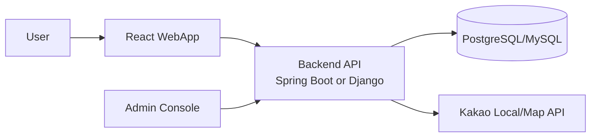
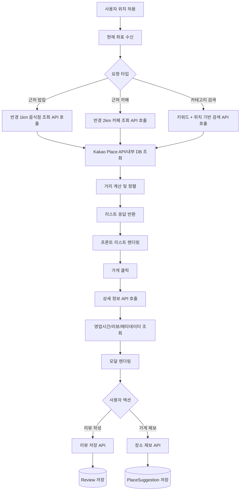
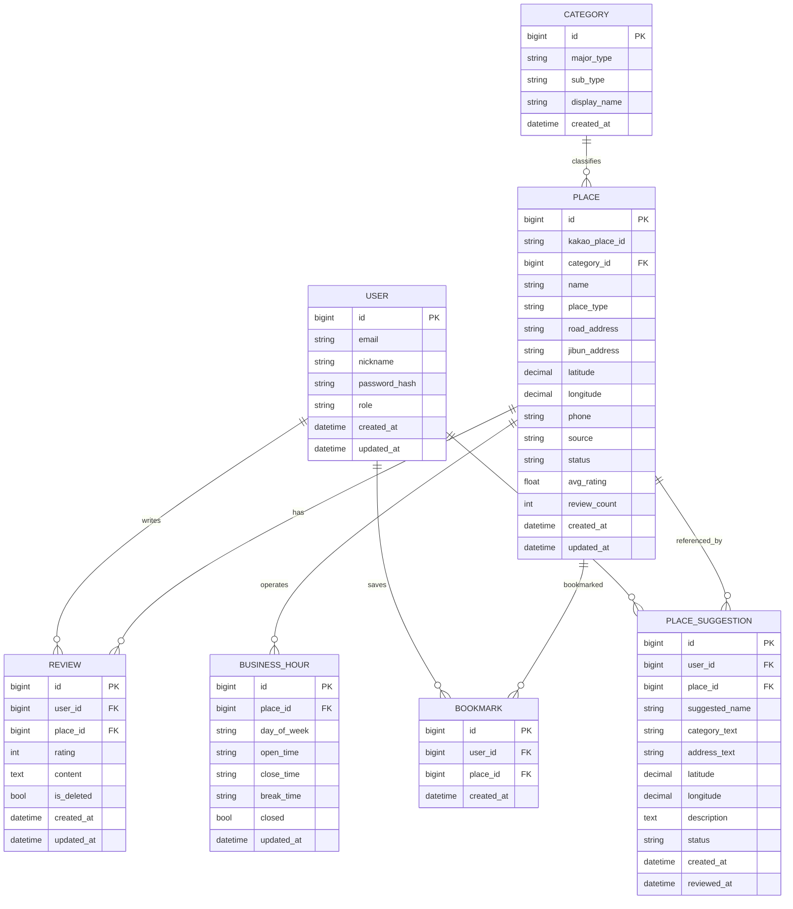

# 대동맛지도 프로젝트 설계 초안

## 프로젝트 개요
대동맛지도는 사용자 현재 위치를 기준으로 주변 음식점과 카페를 탐색하고, 음식 장르 검색과 사용자 리뷰/제보 기능까지 확장하는 지역 기반 맛집 웹앱이다.

## 핵심 기능 정의

### 1) 주변 음식점 조회
- 현재 위치(latitude, longitude)를 기준으로 반경 1km 이내 음식점을 조회한다.
- 조회 결과는 거리순으로 정렬하여 리스트로 반환한다.
- 중복 장소 제거, 폐업/운영 상태 필터링, 페이지네이션 또는 무한스크롤을 고려한다.

### 2) 주변 카페 조회
- 현재 위치(latitude, longitude)를 기준으로 반경 2km 이내 카페를 조회한다.
- 조회 결과는 거리순으로 정렬하여 리스트로 반환한다.
- 음식점 조회와 동일한 응답 포맷을 사용하여 프론트엔드 재사용성을 높인다.

### 3) 음식 장르/카테고리 검색
- 한식, 양식, 중식, 일식 같은 대분류 검색을 지원한다.
- 닭, 돼지, 소, 떡볶이처럼 세부 키워드 검색을 지원한다.
- 위치 기반 결과 + 검색어 기반 결과를 조합해 사용자에게 우선순위 높은 장소를 보여준다.

### 4) 가게 상세 모달
- 가게별 상세 정보(상호명, 주소, 좌표, 전화번호, 영업일, 영업시간, 카카오맵 리뷰 요약/링크)를 조회한다.
- 프론트에서는 음식점/카페 상세를 각각 모달로 띄우되, 백엔드에서는 공통 Place 상세 API로 관리한다.
- 추후 북마크, 이미지, 혼잡도, 메뉴 정보 확장도 가능하다.

### 5) 앱 내 사용자 리뷰
- 로그인한 사용자는 별점/텍스트 리뷰를 작성할 수 있다.
- 리뷰 수정/삭제 권한은 작성자 본인 또는 관리자만 가진다.
- 리뷰 신고, 좋아요, 리뷰 수 기반 정렬 같은 확장 포인트를 고려한다.

### 6) 없는 가게 정보 제보
- 외부 API에 없거나 앱에 등록되지 않은 가게를 사용자가 직접 제안할 수 있다.
- 관리자 승인 후 정식 Place 데이터로 반영한다.
- 이 기능은 서비스 데이터 품질을 높이는 커뮤니티형 기능으로 작동한다.

## 시스템 구조



## 핵심 API Workflow



```
DTO
- 함수 거의 없음
- 역할: 데이터 담기

Entity
- 엔티티 생명주기 관련 함수만 둠
- 예: onCreate(), onUpdate()

Service
- 핵심 로직 함수 둠

- 예:
    - findNearbyRestaurants()
    - calculateDistance()
    - toPlaceNearbyResponse()

Controller
- API 입구 함수 둠
- 예:
    - getNearbyRestaurants()

Repository
- DB 조회 함수 둠
- 예:
    - findByPlaceTypeAndStatus()
```

## ERD



## 엔티티 설계 이유

### USER
- 일반 사용자와 관리자를 함께 관리한다.
- 추후 소셜 로그인(Kakao, Google) 컬럼 확장이 가능하다.

### PLACE
- 외부 API 원천 데이터와 앱 내부 데이터의 기준 테이블이다.
- `source`는 kakao / user_submitted / admin_created 같은 값을 둘 수 있다.
- `status`는 ACTIVE / CLOSED / PENDING 같은 상태값 관리에 사용한다.

### CATEGORY
- 한식/양식/중식/일식 같은 대분류와 닭/돼지/소/떡볶이 같은 검색 키워드 체계를 구조화한다.
- 처음에는 단순 문자열로 시작해도 되지만, 포트폴리오용이라면 테이블 분리를 추천한다.

### BUSINESS_HOUR
- 요일별 영업시간을 정규화해 상세 모달에서 활용한다.
- 휴무일, 브레이크타임, 24시간 영업까지 확장 가능하다.

### REVIEW
- 앱 내부 사용자 리뷰를 저장한다.
- 외부 카카오맵 리뷰는 저장보다 링크/요약/참조 방식이 안전하다.

### PLACE_SUGGESTION
- 없는 가게 추가 요청이나 정보 수정 제보를 처리한다.
- 관리자 승인 프로세스를 만들기 좋은 구조
    - 이유는 : 

### BOOKMARK
- MVP에 필수는 아니지만 사용자 행동 데이터를 보여주기 좋아 포트폴리오 확장용으로 유리하다.

## 백엔드 로직 설계

### A. 근처 음식점/카페 조회
1. 프론트에서 현재 위치 좌표를 전송한다.
2. 백엔드는 요청 타입(restaurant/cafe)과 반경(1km/2km)을 해석한다.
3. 우선 내부 DB 캐시를 조회하고, 부족하면 Kakao API를 호출한다.
4. 결과에 대해 거리 계산(Haversine 또는 DB GIS 함수) 후 반경 내 데이터만 필터링한다.
5. 거리순 정렬 후 리스트 DTO로 반환한다.

### B. 카테고리 검색
1. 검색어를 대분류/세부 키워드로 정규화한다.
2. 위치 좌표가 있으면 근접한 결과를 우선 정렬한다.
3. 장소명, 카테고리명, 키워드 태그를 기준으로 검색한다.
4. 검색 결과가 없으면 유사 키워드 또는 인기 카테고리를 제안한다.

### C. 상세 모달 조회
1. placeId로 장소 상세를 조회한다.
2. 장소 기본 정보 + 영업시간 + 앱 내부 리뷰를 함께 반환한다.
3. 외부 카카오 리뷰는 정책상 직접 저장보다 원문 링크 또는 제한적 요약 제공 방식을 검토한다.

### D. 사용자 리뷰 작성
1. 인증된 사용자만 리뷰 작성 가능
2. 동일 사용자-동일 장소 리뷰 1개 제한 여부 정책 결정
3. 리뷰 저장 후 장소 평균 평점/리뷰 수를 비동기 또는 트랜잭션 내 갱신

### E. 장소 제보
1. 사용자가 신규 장소 또는 수정 요청 제출
2. 상태값을 `PENDING`으로 저장
3. 관리자가 검토 후 승인 시 PLACE 반영 또는 신규 등록

## 추천 API 초안

| Method | URL | 설명 |
|---|---|---|
| GET | `/api/places/nearby/restaurants?lat={lat}&lng={lng}&radius=1000` | 반경 1km 음식점 조회 |
| GET | `/api/places/nearby/cafes?lat={lat}&lng={lng}&radius=2000` | 반경 2km 카페 조회 |
| GET | `/api/places/search?keyword=떡볶이&lat={lat}&lng={lng}` | 카테고리/키워드 검색 |
| GET | `/api/places/{placeId}` | 장소 상세 조회 |
| GET | `/api/places/{placeId}/reviews` | 장소 리뷰 목록 |
| POST | `/api/places/{placeId}/reviews` | 리뷰 작성 |
| POST | `/api/place-suggestions` | 신규 장소/정보 수정 제보 |
| GET | `/api/admin/place-suggestions` | 관리자 제보 목록 조회 |
| PATCH | `/api/admin/place-suggestions/{id}` | 관리자 승인/반려 처리 |

## 폴더 구조 예시

### Spring Boot 기준
```text
src/main/java/com/daedongmap
 ┣ domain
 ┃ ┣ place
 ┃ ┣ review
 ┃ ┣ user
 ┃ ┣ category
 ┃ ┗ suggestion
 ┣ global
 ┃ ┣ auth
 ┃ ┣ config
 ┃ ┣ exception
 ┃ ┗ common
 ┣ api
 ┃ ┣ place
 ┃ ┣ review
 ┃ ┗ admin
 ┗ external
   ┗ kakao
```

## 포트폴리오용 구현 우선순위

### 1차 MVP
- 현재 위치 가져오기
- 반경 1km 음식점 조회
- 반경 2km 카페 조회
- 카테고리 검색
- 장소 상세 모달

### 2차 확장
- 회원가입/로그인
- 앱 내부 리뷰 CRUD
- 북마크
- 장소 제보

### 3차 고도화
- 관리자 승인 페이지
- 인기순/거리순/평점순 정렬
- Redis 캐시
- ElasticSearch 또는 전문 검색 고도화
- 추천 시스템(유사 취향, 인기 카테고리)
